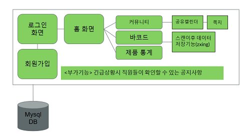

# 바코드 스캔 & 재고 관리 어플리케이션 & 커뮤니티

 
 

## 프로젝트 개요

바코드 스캐너(zxing)를 활용한 재고관리 App 입니다.
web 커뮤니티 기능도 포함되어 있습니다.

 
 

## 핵심 언어/도구

- PHP
- JSP
- Android Studio
- HTML/CSS
- MySQL
- dothome free hosting
- eclipse

 
 

## 설계도

 

안드로이드와 mySQL을 PHP를 활용하여 연결 시켰습니다.
안드로이드 쪽 서버는 dothome 무료 호스팅을 이용하였으나 web 커뮤니티 쪽은 로컬 호스트를 사용하였습니다.

 
 

## 실행 영상

 
 

## 보완해야할 점

- 회원가입 페이지의 로그인으로 돌아가는 text에 action을 추가하지 않았습니다.
- web 커뮤니티의 회원 DB와 쪽지 및 공지사항 기능이 연동되지 않아 action이 모두 개별적으로 이루어집니다. 

 
 

## 참조 오픈 소스

- 회원가입, 로그인 및 리스트 출력
<https://github.com/GaKaRi/gakari_android/tree/master/Proj_Manager_v5>

- zxing 바코드 커스텀
<https://github.com/dolsanta/CustomZxingTest>
